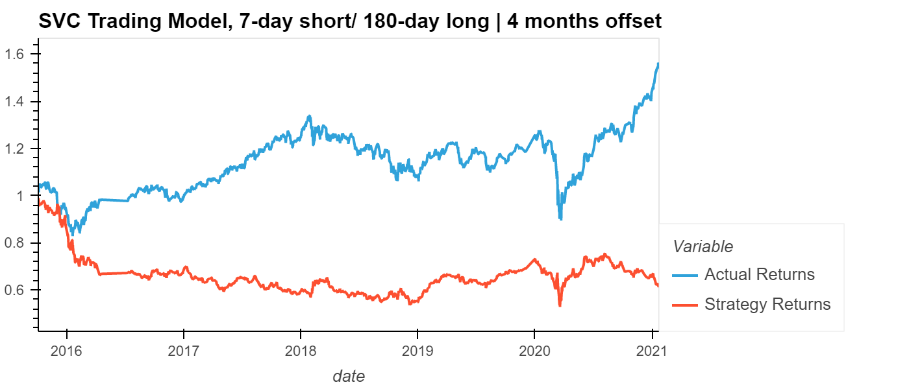

# **Algorithmic Trading Bot - Report**
----
## *Comparing Trading Models and the Results*

Mutliple algorithmic trading models were used to build a trading bot that would predict actual returns using trade signals. The SVC Classifier, ADA Booster Classifier, and Decision Tree Classifier models were used on datasets with variations in short/long day trading signals and number of month offsets.

The 3 month offset with a 4-day short and 100-day long window model presented the following results:

The tuned 4 months offset with a 7-day short and 180 day long model presented the following results:

Based on these results, the ADA Booster Classifier model proved to be a much better algorithmic trading model. Especially so, with the short and long term signals at 7-day and 180-day intervals and a 4 month offset. This is not only shown in the graph, but also in the classification report --- where the count balance for buy/sell trades was the most balanced.

*Did this new model perform better or worse than the provided baseline model? Did this new model perform better or worse than your tuned trading algorithm?*

The new and tuned trading algorithm models worked better than the one baseline model that used the SVC Classifier. ADA Booster and Decision Tree models even performed better with the 4-day short, 100-day long and 3 months offset parameters. One concern that could be raised, is the number of support values for buy/sell trades that were shown on the classification report for ADA Booster and Decision Tree. The numbers were very imbalanced. 

The imbalance was fixed, once the parameters were changed.

