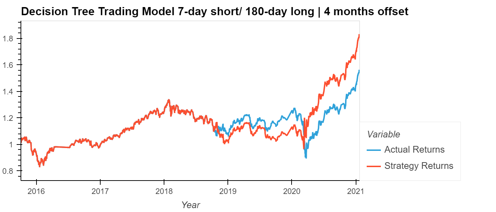

# **Algorithmic Trading Bot - Report**
----
## *Comparing Trading Models and the Results*

Mutltile algorithmic trading models were used to build a trading bot that would predict actual returns in trading signals with as much accuracy as possible. the SVC Classifier and Decision Tree Classifier models were used on datasets with variations in short/long trading signals and number of month offsets.

The results for the 3 month offset with a 4-day short and 100-day long model present the following:

The results for the 3 months offset with a 7-day short and 180 day long model preset the following:

Based on these results, the Decision Tree Classifier proved to be a much better algorithmic trading model. Especially so, with the short and long term signals at 4-day and 100-day intervals.

Did this new model perform better or worse than the provided baseline model? Did this new model perform better or worse than your tuned trading algorithm?

What impact resulted from increasing or decreasing the training window?

What impact resulted from increasing or decreasing either or both of the SMA windows?